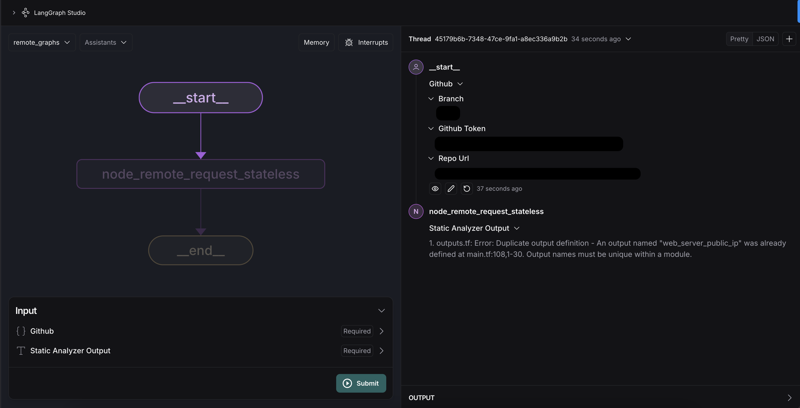

# Terraform Code Analyzer AI Agent
[](CHANGELOG.md)
[](CODE_OF_CONDUCT.md)

Streamline execution of Terraform linters, with actionable AI insights as output.

## **Overview**
The **Terraform Code Analyzer AI Agent** conforms to AGNTCY specs as described https://github.com/agntcy.

This langchain agent runs `terraform validate` and `tflint` linters on a set of Terraform code inputs, and interprets the results using OpenAI. By leveraging OpenAI, the agent provides actionable insights and guidance on how to resolve issues identified by the linter.

It can be used by developers who are building GenAI agentic applications that would benefit from insertion of basic linting of Terraform code. 

The **Terraform Code Analyzer AI Agent** offers value to agentic application developers by saving the effort of writing code to run standard terraform linters, providing an out-of-the-box solution that can be easily inserted into agentic applications using the agntcy approach.


## **📌 About the Project**
This repository contains a **Terraform Code Analyzer AI Agent**. It performs static analysis on Terraform code to detect security risks, misconfigurations, and anti-patterns.

There are two key analysis steps executed with this agent:
1. runs `terraform validate` and returns the results; if this run fails, then stop.
2. runs `tflint` and returns the results. Note that to allow execution of `tflint`, it first runs `terraform init`.

This agent was built with **FastAPI**, that can operate in two modes:

- As a **standard API** compatible with [LangChain’s Agent Protocol](https://github.com/langchain-ai/agent-protocol) — an open-source framework for interfacing with AI agents.
- As a **client of the Agent Gateway Protocol (AGP)** — a gRPC-based protocol enabling secure and scalable communication between AI agents.

## Key Features

- **Dual Interface Support**:
  - **LangChain Agent Protocol API**: Exposes HTTP endpoints following the Agent Protocol spec for easy integration with LangChain-based ecosystems.
  - **AGP Client (Fire-and-Forget Only)**: Sends non-blocking, one-way messages via AGP — ideal for asynchronous agent workflows without waiting for a response.

- **Security**:  
  When operating via AGP, all communication is protected using authentication, authorization, and end-to-end encryption.

- **JSON-based Logging**:  
  Structured, machine-readable logs to support observability and debugging.

- **CORS Configuration**:  
  Enables secure cross-origin API access from web clients or frontends.

- **Route Tagging**:  
  Tagged routes for better documentation, navigation, and maintainability.

---

## **📋 Prerequisites**
Before installation, ensure you have:
- **Python 3.12+** installed
- A **virtual environment** (recommended for dependency isolation)

---

## **⚙️ Installation Steps**

### **1️⃣ Clone the Repository**

```bash
git clone https://github.com/cisco-ai-agents/tf-code-analyzer-agntcy-agent
cd tf-code-reviewer-agntcy-agent
```

### **2️⃣ Install Dependencies**

```bash
pip install -r requirements.txt
```

### **3️⃣ Install Required Executables**

Before using this package, ensure the following tools are installed on your system:

- **Terraform** → [Installation Guide](https://developer.hashicorp.com/terraform/tutorials/aws-get-started/install-cli)
- **TFLint** → [Installation Guide](https://github.com/terraform-linters/tflint)

---

## 🚀 **Required Environment Variables**

Before running the application, ensure you have the following environment variables set in your `.env` file or in your system environment.

---

## **🔹 OpenAI API Configuration**

If configuring your AI agent to use OpenAI as its LLM provider, set these variables:

```dotenv
# OpenAI API Configuration
OPENAI_API_KEY=your-openai-api-key-here
OPENAI_MODEL_NAME=gpt-4o  # Specify the model name
OPENAI_TEMPERATURE=0.7    # Adjust temperature for response randomness
```

---

## **🔹 Azure OpenAI API Configuration**

If configuring your AI agent to use Azure OpenAI as its LLM provider, set these variables:

```dotenv
# Azure OpenAI API Configuration
AZURE_OPENAI_API_KEY=your-azure-api-key-here
AZURE_OPENAI_ENDPOINT=https://your-resource-name.openai.azure.com
AZURE_OPENAI_DEPLOYMENT_NAME=your-deployment-name  # Deployment name in Azure
AZURE_OPENAI_API_VERSION=your-azure-openai-api-version  # API version
OPENAI_TEMPERATURE=0.7 # Adjust temperature for response randomness
```

---

## **🔹 AGP Client Configuration**

```dotenv
AGP_GATEWAY_ENDPOINT = "http://<your-agp-gateway-host>:<port>"
```

---

## **🔹 GitHub Configuration (For Client Application)**

If running the client, set these variables to interact with GitHub:

```dotenv
# GitHub Repository Configuration
GITHUB_REPO_URL=https://your-github-url  # The repository to analyze
GITHUB_BRANCH=main  # The branch containing the code to be analyzed

# Optional GitHub Authentication
GITHUB_TOKEN=your-github-token  # (Optional) Provide a token for private repos
```

🔹 **Note:** If analyzing a **public repository**, `GITHUB_TOKEN` is **optional**.

---

✅ **Now you're ready to run the application!**
### Server

You can run the application by executing:

```bash
python app/main.py
```
---

### Expected Console Output

On a successful run, you should see logs in your terminal similar to the snippet below. The exact timestamps, process IDs, and file paths will vary:

```bash
python app/main.py
{"timestamp": "2025-03-11 13:24:36,754", "level": "INFO", "message": "Logging is initialized. This should appear in the log file.", "module": "logging_config", "function": "configure_logging", "line": 142, "logger": "app", "pid": 5004}
{"timestamp": "2025-03-11 13:24:36,754", "level": "INFO", "message": "Starting FastAPI application...", "module": "main", "function": "main", "line": 155, "logger": "app", "pid": 5004}
{"timestamp": "2025-03-11 13:24:36,758", "level": "INFO", "message": ".env file loaded from <your_cloned_repo_path>/.env", "module": "utils", "function": "load_environment_variables", "line": 64, "logger": "root", "pid": 5004}
INFO:     Started server process [5004]
INFO:     Waiting for application startup.
{"timestamp": "2025-03-11 13:24:36,864", "level": "INFO", "message": "Starting Terraform Code Analyzer Agent", "module": "main", "function": "lifespan", "line": 39, "logger": "root", "pid": 5004}
INFO:     Application startup complete.
INFO:     Uvicorn running on http://127.0.0.1:8133 (Press CTRL+C to quit)
{"timestamp": "2025-03-21 17:01:31,084", "level": "INFO", "message": "AGP client started for agent: cisco/default/<bound method AgentContainer.get_local_agent of <agp_api.agent.agent_container.AgentContainer object at 0x106dbba10>>", "module": "gateway_container", "function": "start_server", "line": 321, "logger": "agp_api.gateway.gateway_container", "pid": 67267}
```

This output confirms that:

1. Logging is properly initialized.
2. The server is listening on `0.0.0.0:8133`.
3. Your environment variables (like `.env file loaded`) are read.

---

### AP REST Client

*Change to `client` folder*

```bash
python client/stateless_client
```

On a successful remote graph run you should see logs in your terminal similar to the snippet below:

```bash
{"timestamp": "2025-03-11 13:26:29,622", "level": "ERROR", "message": "{'event': 'final_result', 'result': {'github': {'repo_url': '<your_repo_url>', 'github_token': '<your_token>', 'branch': '<your_branch>'}, 'static_analyzer_output': '<analyzer_output>'}}", "module": "stateless_client", "function": "<module>", "line": 174, "logger": "__main__", "pid": 7529}
```


### Running the AGP Gateway & Testing Agent Communication

To enable agent-to-agent communication via the **Agent Gateway Protocol (AGP)**, you’ll first need to run the AGP Gateway locally. A shell script is included to simplify this.

*Start the AGP Gateway*

From the root of the project, run:

```bash
./scripts/run_agp_gateway.sh
```

*Run the client*

Make sure to run the client in a separate terminal as the service.

```bash
python client/agp/agp_client.py
```

---

## Logging

- **Format**: The application is configured to use JSON logging by default. Each log line provides a timestamp, log level, module name, and the message.
- **Location**: Logs typically go to stdout when running locally. If you configure a file handler or direct logs to a centralized logging solution, they can be written to a file (e.g., `logs/app.log`) or shipped to another service.
- **Customization**: You can change the log level (`info`, `debug`, etc.) or format by modifying environment variables or the logger configuration in your code. If you run in Docker or Kubernetes, ensure the logs are captured properly and aggregated where needed.

---
## API Endpoints

By default, the API documentation is available at:

```bash
http://0.0.0.0:8133/docs
```

(Adjust the host and port if you override them via environment variables.)

---
## Running as a LangGraph Studio

You need to install Rust: <https://www.rust-lang.org/tools/install>

Run the server

```bash
langgraph dev
```

Populate the Github input field with: 
```json
{
   "repo_url": "https://<your_repo_url>",
   "github_token": "<your_github_token>",
   "branch": "<your_github_branch>"
}
```

Upon successful execution, you should see:



---
## Roadmap

See the [open issues](https://github.com/cisco-ai-agents/tf-code-analyzer-agntcy-agent/issues) for a list
of proposed features (and known issues).

---
## Contributing

Contributions are what make the open source community such an amazing place to
learn, inspire, and create. Any contributions you make are **greatly
appreciated**. For detailed contributing guidelines, please see
[CONTRIBUTING.md](CONTRIBUTING.md)

---
## License

Distributed under the Apache-2.0 License. See [LICENSE](LICENSE) for more
information.

---
## Contact

[cisco-outshift-ai-agents@cisco.com](mailto:cisco-outshift-ai-agents@cisco.com)

Project Link:
[https://github.com/cisco-ai-agents/tf-code-analyzer-agntcy-agent](https://github.com/cisco-ai-agents/tf-code-analyzer-agntcy-agent)

---
## Acknowledgements

- [tflint](https://github.com/terraform-linters) for the linter.
- [Langgraph](https://github.com/langchain-ai/langgraph) for the agentic platform.
- [https://github.com/othneildrew/Best-README-Template](https://github.com/othneildrew/Best-README-Template), from which this readme was adapted

For more information about our various agents, please visit the [agntcy project page](https://github.com/agntcy).


To Add:
- How to run AGP Gateway (docker image shell script)
- AGP integration details
